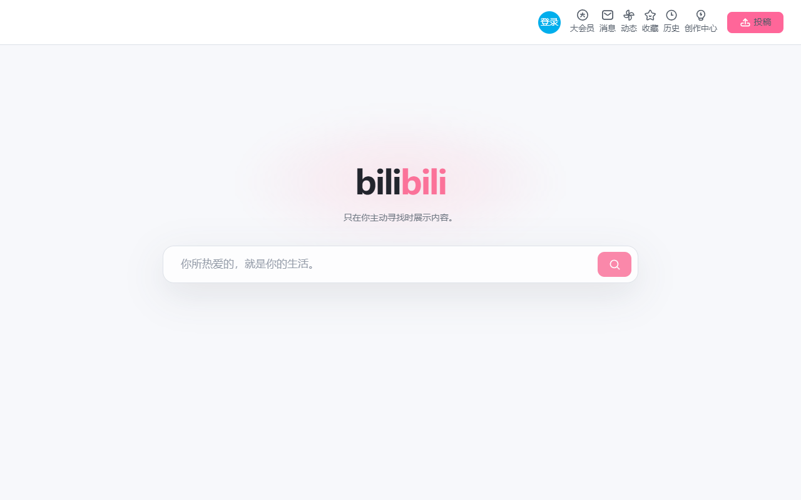
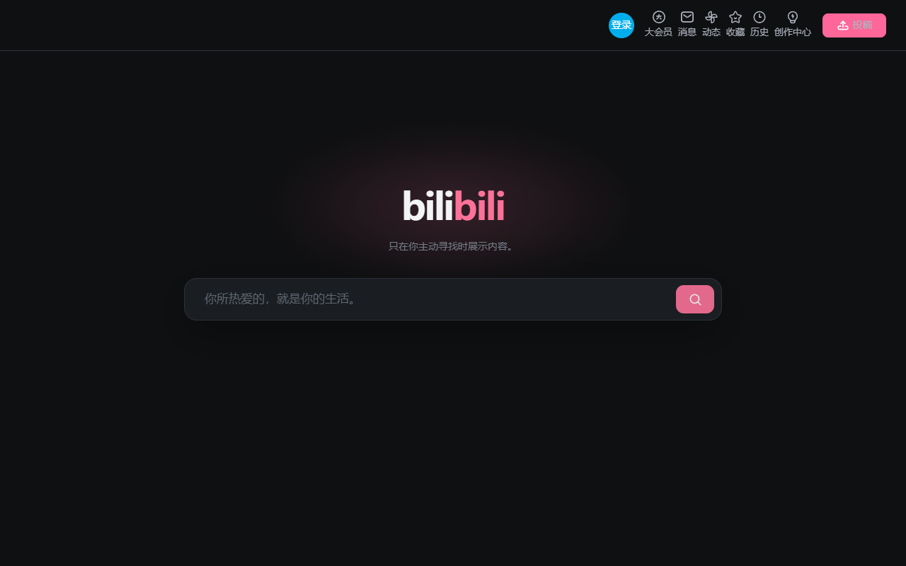

# bilibili Minimal Home

[简体中文](README.md) · **English** · [日本語](README.ja.md)

An unofficial Chrome and Edge extension that turns the Bilibili root homepage into a focused search page while keeping the site's native search and account controls.

> This project is independent and is not affiliated with or endorsed by Bilibili.

## Preview

| Light mode | Dark mode |
| --- | --- |
|  |  |

## What it does

- Changes only the root page at `https://www.bilibili.com/`; other paths retain the site's original layout.
- Hides the recommendation feed, banners, and channel navigation while keeping and repositioning the native search box, search history, suggestions, and account controls.
- Hides the trending section in the search dropdown without leaving an empty dropdown when there is no history.
- Follows the browser's light or dark mode. If the native components do not load, the original page reappears after eight seconds.

Search input, suggestions, and navigation remain handled by Bilibili. The extension has no account system, analytics service, or network requests of its own.

## Download and install

[Download the v1.2.2 ZIP from GitHub Releases](https://github.com/qikai2007820-svg/bilibili-minimal-home/releases/download/v1.2.2/bilibili-minimal-home-1.2.2.zip), extract it, then:

1. Open `chrome://extensions/` in Chrome or `edge://extensions/` in Edge.
2. Enable **Developer mode** and choose **Load unpacked**.
3. Select the extracted folder that **directly contains `manifest.json`**.
4. Open or refresh the Bilibili root homepage.

You can also download this repository and load the [`bilibili-minimal-home`](bilibili-minimal-home/) folder. See its [README](bilibili-minimal-home/README.md) for debugging details.

## Privacy and compatibility

The extension checks page structure and the current URL locally in your browser. It does not read search input or account details, or store or upload that information. Read the [privacy policy](https://qikai2007820-svg.github.io/bilibili-minimal-home/store-assets/privacy-policy.html).

The layout depends on Bilibili's current page structure. A site redesign may require updated selectors. Please open an Issue if something breaks.
